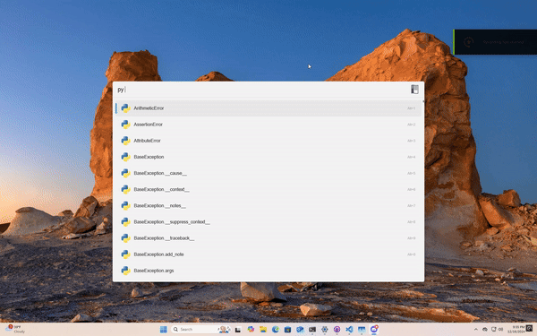
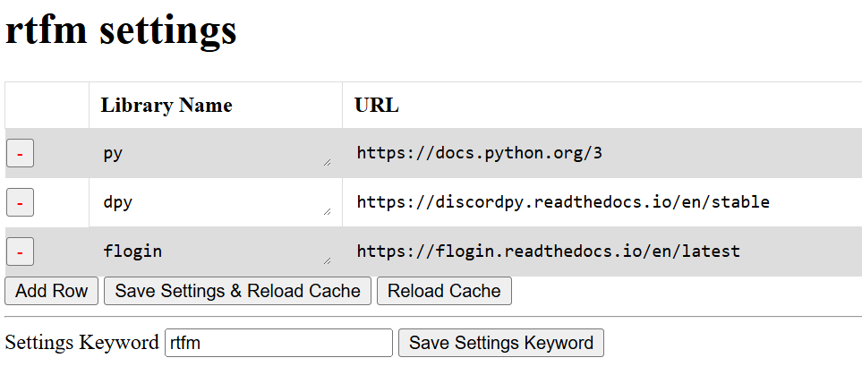

# Flow.Launcher.Plugin.Rtfm

## Credits
- Credits to [Danny/Rapptz](https://github.com/Rapptz) for the original intersphinx code
- Credits to [Yusyuriv](https://github.com/Yusyuriv) for writing the frontend code for the webserver.
- The webserver's design is based on [Figma SDS](https://github.com/figma/sds/) (licensed under MIT)

## Settings

Rtfm has a custom settings page where you can add/remove your libraries, along with customize the plugin's main keyword.

## Icons/Favicons

By default, this plugin will download the documentation's favicon using an undocumented google api. However, if those websites use SVG files, those icons look pretty messy and dirty. If you have [ImageMagick](https://imagemagick.org/script/download.php#windows) installed on your computer, rtfm will detect that, and use imagemagick to get crisp and clean icons for the results.

### Example: Python Documentation Logo

Without ImageMagick

With ImageMagick

