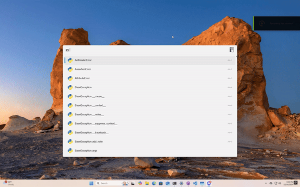

rtfm plugin
===========
The rtfm plugin for `flow launcher <https://www.flowlauncher.com/>`__ makes it easy to query docs or manuals.

For a list of versions that documentation is available for, see `here <https://rtfm.cibere.dev>`__.

Getting Help
-------------
Need help? Either create an `issue request on github <https://github.com/cibere/Flow.Launcher.Plugin.rtfm/issues/new>`__, or join the `official flow discord server <https://discord.gg/QDbDfUJaGH>`__ and ask there.

Demo
-----

Credits
-------
- Credits to `Danny/Rapptz <https://github.com/Rapptz>`__ for the original intersphinx code
- Credits to `Yusyuriv <https://github.com/Yusyuriv>`__ for writing the frontend code for the settings website.
- The webserver's design is based on `Figma SDS <https://github.com/figma/sds/>`__ (licensed under MIT)
